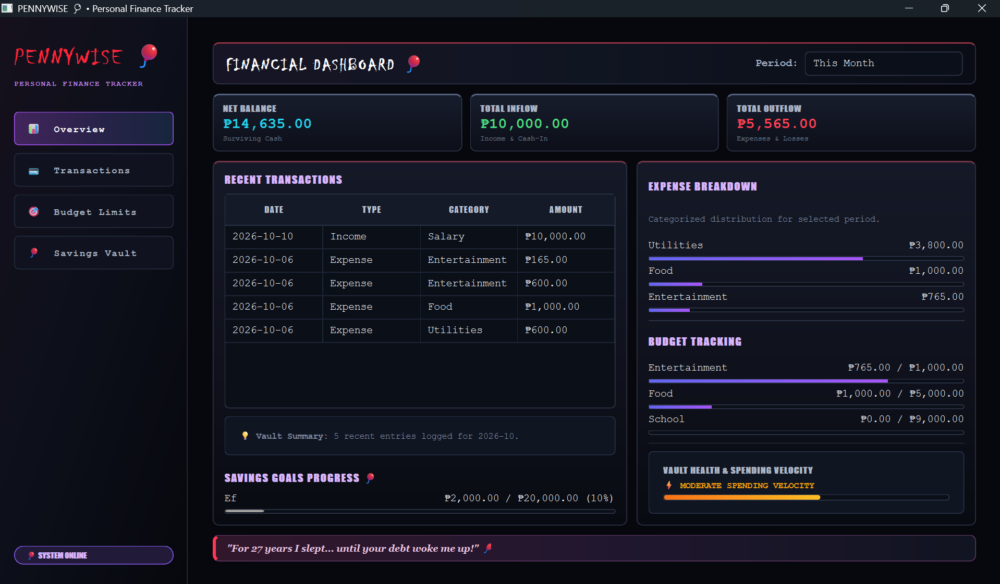
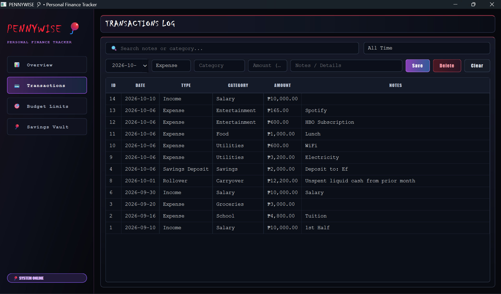
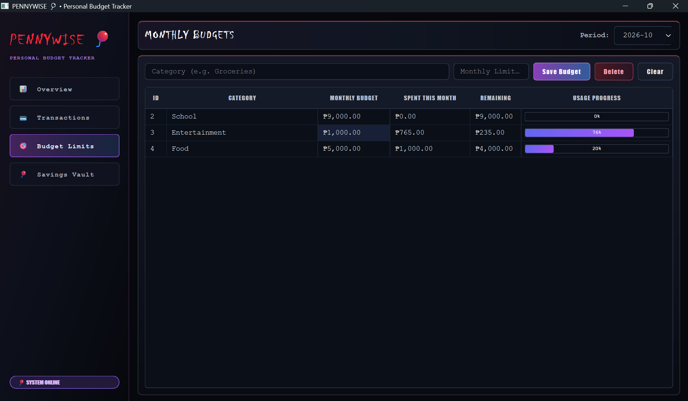
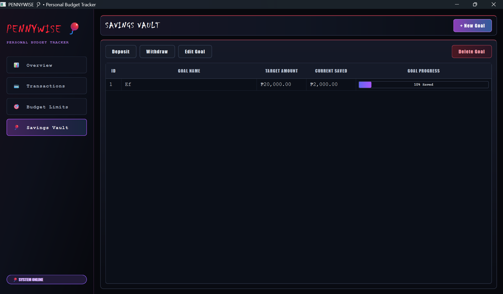

# PennyWise: Personal Budget Tracker

PennyWise is a desktop-based personal budget management system developed to help users record, organize, and monitor their personal finances in one application. The system allows users to manage income and expenses, set category-based budget limits, create savings goals, and view financial summaries through a graphical interface.

The project uses Python with PyQt6 for the graphical user interface and SQLite for local data storage. Its main purpose is to provide a simple and organized way of managing financial records without requiring an online account or cloud-based service.

---

## 1. Project Objectives

The main objectives of PennyWise are to:

* Provide a desktop application for managing personal financial records.
* Allow users to record and manage income and expense transactions.
* Allow users to search and filter transaction records.
* Allow users to create and monitor category-based budget limits.
* Allow users to create savings goals and manage deposits and withdrawals.
* Automatically connect savings activities with the transaction records.
* Display financial summaries and progress indicators through the dashboard.
* Store financial data locally using an SQLite database.
* Apply object-oriented programming and modular programming concepts in the system.

---

## 2. Features

### Dashboard

The Dashboard provides an overview of the user's financial information. It includes financial summary cards, charts, recent activity, savings progress, and other calculated financial information.

### Transactions

The Transactions section allows users to:

* Add income and expense records.
* Edit existing transactions.
* Delete transactions.
* Search transactions by category or description.
* Filter transactions by period.
* View transaction records in a table.

Savings-related transactions are automatically managed by the Savings Vault and cannot be manually edited or deleted from the transaction section.

### Budget Limits

The Budget Limits section allows users to:

* Select a budget month.
* Set a spending limit for a category.
* View existing category budgets.
* Monitor budget usage.
* View remaining budget amounts.
* Track progress through progress indicators.

### Savings Vault

The Savings Vault allows users to:

* Create savings goals.
* Set a target amount.
* Deposit money into a savings goal.
* Withdraw money from a savings goal.
* Edit savings goals.
* Delete savings goals.
* Monitor savings progress.

Deposits and withdrawals are also recorded as transactions so that savings activity remains connected to the financial records.

---

## 3. Technologies Used

| Technology | Purpose                                       |
| ---------- | --------------------------------------------- |
| Python     | Main programming language                     |
| PyQt6      | Graphical user interface framework            |
| SQLite     | Local database management                     |
| `sqlite3`  | Python library used to connect to SQLite      |
| QSS        | Custom application styling                    |
| Git/GitHub | Source code management and project submission |

---

## 4. Project Structure

```text
pennywise/
├── main.py                         # Entry point; MainWindow connects all screens
├── style.qss                       # Custom stylesheet
├── database/
│   ├── database.py                 # SQLite connection manager & table schema creation
│   └── pennywise.db                # Local SQLite database file
└── features/
    ├── dashboard/                  # Overview and summary insights
    │   ├── service.py              # Financial logic and aggregation
    │   └── view.py                 # Summary cards, charts, and activity log
    ├── transactions/               # Transaction logging, searching, and filtering
    │   ├── model.py                # Transaction dataclass
    │   ├── repository.py           # SQL queries for transaction records
    │   ├── service.py              # Business logic & validation for transactions
    │   └── view.py                 # Transaction log table & entry form
    ├── budget/                     # Budget limit tracking & progress indicators
    │   ├── model.py                # Budget dataclass
    │   ├── repository.py           # SQL queries for budget records
    │   ├── service.py              # Budget usage calculations and alert logic
    │   └── view.py                 # Category budget limit form & progress bars
    └── savings_account/            # Savings Vault operations & ledger integration
        ├── model.py                # SavingsGoal dataclass
        ├── repository.py           # SQL queries for savings records
        ├── service.py              # Deposit/withdrawal rules & transaction sync
        └── view.py                 # Savings goals list & vault controls
```

### Main Components

**`main.py`**
Serves as the entry point of the application. It initializes the database, loads the stylesheet, creates the main window, and connects the Dashboard, Transactions, Budget Limits, and Savings Vault screens.

**`database/database.py`**
Handles the SQLite connection and creates the required database tables.

**`features/dashboard/`**
Contains the dashboard's financial calculations, summaries, charts, and activity information.

**`features/transactions/`**
Handles transaction data, validation, database operations, searching, filtering, and the transaction interface.

**`features/budget/`**
Handles budget limits, budget calculations, progress tracking, and the budget interface.

**`features/savings_account/`**
Handles savings goals, deposits, withdrawals, and the automatic synchronization of savings activities with transaction records.

**`style.qss`**
Contains the custom QSS stylesheet used for the PennyWise graphical interface.

---

## 5. Installation and Setup

### Requirements

Before running PennyWise, make sure the following are installed:

* Python 3
* PyQt6
* Git, if cloning the project from GitHub

### Clone the Repository

```bash
git clone https://github.com/thisisrheality/PennyWise.git
cd pennywise
```

### Create a Virtual Environment

```bash
python -m venv .venv
```

### Activate the Virtual Environment

**Windows:**

```bash
.venv\Scripts\activate
```

**macOS/Linux:**

```bash
source .venv/bin/activate
```

### Install PyQt6

```bash
pip install PyQt6
```

### Run the Application

```bash
python main.py
```

The application initializes the SQLite database and creates the required tables when it starts.

---

## 6. How to Use the System

### Step 1: Open the Application

Run:

```bash
python main.py
```

The PennyWise main window will appear with the navigation sidebar.

### Step 2: View the Dashboard

Open **Overview** to see the current financial summary, recent activity, savings progress, and other calculated information.

### Step 3: Add a Transaction

Go to **Transactions** and enter the required information such as:

* Transaction type
* Category
* Amount
* Description
* Date

The transaction will be stored in the local database.

### Step 4: Search or Filter Transactions

Use the search field to search by category or description. The period filter can also be used to display records for a selected period.

### Step 5: Set a Budget

Open **Budget Limits**, select a month, and create a budget limit for a category. The system displays the budget usage and remaining amount.

### Step 6: Create a Savings Goal

Open **Savings Vault** and create a savings goal by providing a goal name and target amount.

### Step 7: Deposit or Withdraw Savings

Select a savings goal and use the appropriate deposit or withdrawal function.

Savings deposits and withdrawals are automatically recorded in the transaction records.

### Step 8: Monitor Progress

The dashboard, budget section, and savings section provide progress information that can be used to monitor financial activity.

---

## 7. Object-Oriented Programming Implementation

PennyWise applies object-oriented programming through its use of classes, objects, data models, services, repositories, and PyQt6 interface components.

### Classes and Objects

Examples of classes used in the system include:

* `Database`
* `MainWindow`
* `Transaction`
* `TransactionService`
* `TransactionRepository`
* `TransactionsView`
* `SavingsGoal`
* `SavingsService`
* `SavingsRepository`
* `SavingsView`
* `BudgetService`
* `BudgetView`
* `DashboardService`
* `DashboardView`

Objects created from these classes work together to manage the different parts of the application.

### Encapsulation

Encapsulation is applied by separating responsibilities into different classes and modules. For example, transaction database operations are handled by the transaction repository, while transaction rules and operations are handled by the transaction service.

### Inheritance

Inheritance is used through PyQt6 components. For example, `MainWindow` inherits from `QMainWindow`, while the different interface classes use PyQt6 widgets as their base components.

### Polymorphism

Polymorphism is not a major focus of the current implementation. The project mainly uses inheritance from PyQt6 classes and separates system responsibilities through models, repositories, services, and views.

---

## 8. Database

PennyWise uses **SQLite** as its local database.

The database file is:

```text
database/pennywise.db
```

The database contains the following tables:

### `transactions`

Stores income, expense, and savings-related transaction records.

| Field         | Purpose                       |
| ------------- | ----------------------------- |
| `id`          | Unique transaction identifier |
| `type`        | Transaction type              |
| `category`    | Transaction category          |
| `amount`      | Transaction amount            |
| `description` | Transaction description       |
| `date`        | Transaction date              |

### `savings_goals`

Stores the user's savings goals.

| Field            | Purpose                        |
| ---------------- | ------------------------------ |
| `id`             | Unique savings goal identifier |
| `title`          | Name of the savings goal       |
| `target_amount`  | Target savings amount          |
| `current_amount` | Current saved amount           |

### `budgets`

Stores category-based budget limits.

| Field           | Purpose                       |
| --------------- | ----------------------------- |
| `id`            | Unique budget identifier      |
| `category`      | Budget category               |
| `monthly_limit` | Budget limit for the category |
| `month`         | Budget month                  |

The system performs database operations for adding, retrieving, updating, and deleting records. Transaction records can also be searched and filtered through the application interface.

---

## 9. Screenshots

### Dashboard



Shows the main financial summary, including KPI information, charts, savings information, and recent activity.

### Transactions



Shows the transaction table and the controls for adding, editing, deleting, searching, and filtering transaction records.

### Budget Limits



Shows category budget limits, usage information, remaining amounts, and progress indicators.

### Savings Vault



Shows savings goals, target amounts, current savings, progress, and vault controls.

---

## 10. Testing

Testing was performed by checking the main functions of the application and observing whether the system responds according to the implemented functionality.

| Test Area           | Test Action                       | Expected Result                                                |
| ------------------- | --------------------------------- | -------------------------------------------------------------- |
| Application Startup | Run `main.py`                     | Main PennyWise window opens                                    |
| Database            | Start the application             | Required SQLite tables are created                             |
| Transactions        | Add an income or expense          | Transaction is stored and displayed                            |
| Transactions        | Edit a transaction                | Selected transaction is updated                                |
| Transactions        | Delete a transaction              | Selected transaction is removed                                |
| Search              | Search by category or description | Matching transactions are displayed                            |
| Filtering           | Select a period                   | Transactions are filtered according to the selected period     |
| Budget              | Create a category budget          | Budget appears in the budget list                              |
| Budget              | Monitor budget usage              | Usage and remaining amount are calculated                      |
| Savings             | Create a savings goal             | Goal appears in the Savings Vault                              |
| Savings             | Deposit into a goal               | Savings amount increases and a savings transaction is recorded |
| Savings             | Withdraw from a goal              | Savings amount decreases and a savings transaction is recorded |
| Savings             | Withdraw more than available      | Withdrawal is rejected                                         |
| Dashboard           | Refresh financial records         | Summary information is recalculated                            |
---

## 11. Known Issues / Limitations

* **The database is local to the application.** PennyWise stores its records in `database/pennywise.db`. There is no synchronization between different devices, so changes made on one computer are not automatically available elsewhere.

* **Transaction accuracy depends on user input.** Income and expense records are entered manually, so incorrect amounts, categories, dates, or descriptions will also affect the information shown in the dashboard and other financial calculations.

* **Savings transactions are intentionally restricted from the Transactions screen.** Deposits, withdrawals, and refunds created by the Savings Vault are recorded in the transaction table but cannot be manually edited or deleted from the Transactions section. They must be managed through the Savings Vault to keep the savings balance and transaction record consistent.

* **Budget monitoring only considers transactions recorded in PennyWise.** Expenses made outside the application are not included automatically, so the displayed budget usage may not represent all of a user's actual spending.

* **There is no built-in backup or restore function.** The application currently relies on the local SQLite database file for stored financial records.

* **The application is currently run through the Python environment.** It has not yet been packaged as a standalone executable, so Python and the required dependencies must be available on the machine where it is run.

* **Testing is primarily manual.** The current project does not contain an automated unit-testing suite. Its main functions are tested by running the application and checking the expected behavior of each feature.

**Possible future work:** Add database backup and restore, provide CSV or PDF export, improve transaction and budget date handling, add automated tests, support external financial data import, and package PennyWise as a standalone desktop application.


---

## 12. Author

**Name:** Rhea Antonette B. Pardillo

**Section:** CS26/L (3581)

---
